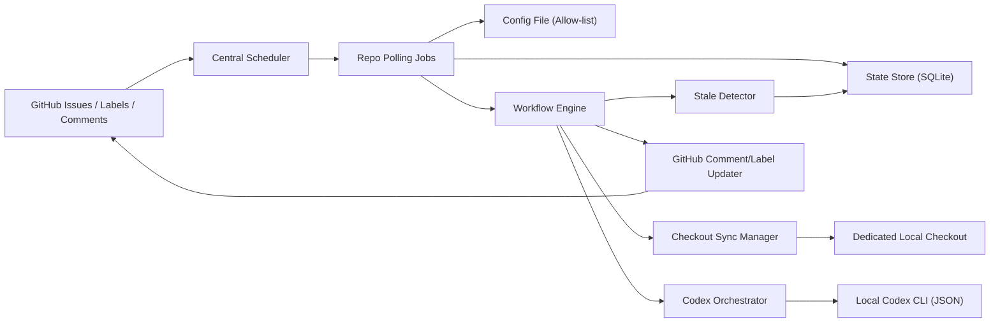

# GitHub Issue Analyzer 기획문서

- 작성일: 2026-03-06
- 문서 상태: 설계 확정안
- 구현 언어: Python
- AI 실행 환경: 로컬 Codex 터미널
- 운영 방식: 사용자 로컬 PC 상시 실행
- 운영 대상: 저장소 소유자 본인의 GitHub 저장소 중 allow-list에 등록된 저장소

## 1. 프로젝트 개요

GitHub Issue Analyzer는 GitHub Issue를 읽고, 요구사항이 모호하면 질문으로 구체화한 뒤, 로컬 Codex 터미널이 실제 코드베이스를 읽어 예상 작업량을 line 단위 범위로 추정하고, 그 결과를 GitHub 댓글과 라벨에 반영하는 Python 프로그램이다.

이 시스템은 "이슈 감지 -> 요구사항 명확화 -> 코드 기반 작업량 추정 -> stale 감지 -> 수동 재평가" 흐름을 자동화하는 것을 목표로 한다.

## 2. 목표

### 2.1 제품 목표

- 새 이슈를 near real-time으로 감지한다.
- 요구사항이 불충분하면 질문 루프를 통해 명확화한다.
- 요구사항이 충분해질 때까지 추정을 시작하지 않는다.
- 로컬 코드 기준으로 예상 변경 범위를 line 단위로 제시한다.
- 추정 결과와 처리 상태를 GitHub에 남긴다.
- 코드 변경 또는 요구사항 변경 이후 재평가할 수 있다.

### 2.2 성공 기준

- 새 이슈 또는 트리거 라벨 부착 후 1분 이내에 첫 반응이 시작된다.
- 명확화가 필요한 이슈는 자동 질문 댓글을 받는다.
- 필수 슬롯이 모두 채워진 이슈만 추정 단계로 진입한다.
- 추정 후 관련 파일 변경이 생기면 stale 상태로 전환될 수 있다.
- 사용자가 `/refresh`로 전체 재평가를 다시 실행할 수 있다.

## 3. 확정된 운영 원칙

- 이 시스템은 PR이 아니라 GitHub Issue만 처리한다.
- 여러 저장소를 지원하지만, 저장소 소유자 본인의 저장소만 allow-list로 등록할 수 있다.
- 저장소 등록은 단일 설정 파일에서 관리한다.
- 실행 프로세스는 중앙 scheduler가 저장소별 job을 관리하는 구조를 따른다.
- 각 저장소는 봇 전용의 별도 로컬 체크아웃을 가진다.
- 이슈는 트리거 라벨이 있을 때만 자동 처리 대상이 된다.
- 봇은 issue author와 repository owner의 본문 수정/댓글만 요구사항 입력으로 인정한다.
- 권한 없는 사용자의 댓글과 명령은 조용히 무시한다.
- 봇 자신의 댓글과 라벨 변경 이벤트는 무시한다.
- 댓글 언어는 한국어를 기본으로 한다.
- GitHub 인증은 Personal Access Token을 사용한다.

## 4. 범위

### 4.1 포함 범위

- 다중 저장소 지원
- allow-list 등록 저장소만 감시
- polling 기반 이슈/댓글/라벨 이벤트 감지
- 트리거 라벨 기반 이슈 진입
- 요구사항 명확화 질문 생성
- 로컬 Codex CLI 비대화형 실행
- 코드 기반 작업량 추정
- stale 감지
- `/refresh`, `/stop` 명령 처리
- GitHub 댓글 작성
- GitHub 라벨 갱신

### 4.2 제외 범위

- Pull Request 처리
- 자동 코드 작성 및 PR 생성
- 조직 단위 권한 체계
- 서버 배포를 전제로 한 webhook 기반 운영
- MVP 단계의 GitHub Projects v2 / issue field 실제 업데이트

### 4.3 단계적 확장 범위

MVP는 라벨 중심으로 운영한다. 다만 초기 아키텍처는 이후 GitHub Projects v2 또는 issue field 연동을 붙일 수 있도록 메타데이터 갱신 계층을 분리한다.

## 5. 사용자와 권한

- 저장소 소유자
  - 저장소 등록, bootstrap, `/stop`, 라벨 관리
- 이슈 작성자
  - 요구사항 답변, `/refresh`
- GitHub Issue Analyzer
  - 이벤트 감지, 상태 전이, Codex 실행, 댓글/라벨 반영
- 로컬 Codex 터미널
  - 요구사항 해석, 질문 생성, 코드 분석, line 범위 추정

권한 규칙은 아래와 같다.

- 요구사항 입력으로 인정되는 주체: 저장소 소유자, 이슈 작성자
- `/refresh` 허용 주체: 저장소 소유자, 이슈 작성자
- `/stop` 허용 주체: 저장소 소유자만
- 그 외 사용자의 댓글과 명령은 무시

## 6. 저장소 등록 및 실행 모델

### 6.1 저장소 등록

저장소는 단일 설정 파일에 allow-list로 등록한다. 저장소별로 최소 아래 정보가 필요하다.

- `owner/repo`
- 전용 로컬 체크아웃 경로
- 트리거 라벨 이름
- 명확화 리마인드 일수

트리거 라벨은 공통 기본값을 두되, 저장소별 override를 허용한다.

권장 기본값:

- 트리거 라벨: `ai:analyze`
- 명확화 리마인드: 7일

### 6.2 실행 구조

- 중앙 scheduler가 등록된 저장소 목록을 순회한다.
- 저장소별로 polling job을 실행한다.
- 각 job은 이슈/댓글/라벨 이벤트를 읽고 상태 전이를 수행한다.
- Codex 분석은 저장소별 전용 체크아웃을 기준으로 수행한다.

## 7. 핵심 워크플로

### 7.1 이슈 진입 조건

이슈는 아래 중 하나를 만족할 때 분석 대상이 된다.

- 이슈 생성 시점에 트리거 라벨이 이미 붙어 있음
- 생성 후 트리거 라벨이 새로 부착됨

트리거 라벨이 나중에 부착된 경우, 시스템은 그 시점 이후만 읽는 것이 아니라 현재 이슈 스냅샷 전체를 사용한다.

현재 이슈 스냅샷의 범위:

- 최신 이슈 본문
- 그 시점까지 존재하는 인정 가능한 댓글 전체

트리거 라벨은 "시작 신호"이다. 시작 후 단순 라벨 제거만으로 기존 워크플로를 중단하지 않는다.

### 7.2 요구사항 명확화

이슈는 다음 필수 슬롯이 모두 충족될 때까지 추정 단계로 가지 않는다.

- 목적
- 기대 동작
- 입력/출력
- 변경 대상
- 완료 조건

`입력/출력`은 해당 없는 경우 `N/A`를 허용한다.

보조 슬롯:

- 예외 케이스

보조 슬롯은 상황에 따라 질문할 수 있지만, 모든 이슈에서 필수는 아니다.

명확화 규칙:

- 본문 수정과 댓글 답변을 모두 입력으로 인정한다.
- 이미 답변된 내용은 반복 질문하지 않는다.
- 한 번에 2~5개 질문만 남긴다.
- 필요한 슬롯이 모두 채워질 때까지 질문 루프를 계속한다.
- 답이 없으면 `needs-clarification` 상태를 유지한다.
- 설정된 일수 경과 후 1회만 리마인드 댓글을 남긴다.

### 7.3 작업량 추정 시작 조건

아래 조건이 모두 만족될 때만 추정을 시작한다.

- 이슈가 트리거 라벨 대상이다.
- 필수 슬롯이 모두 채워졌다.
- 이슈가 `STOPPED` 상태가 아니다.
- 이슈가 `open` 상태다.

### 7.4 코드 동기화 기준

추정 또는 재평가 직전에는 저장소 전용 체크아웃을 원격 기본 브랜치의 최신 HEAD로 동기화한다.

이 기준은 아래 항목의 기준점이 된다.

- base commit SHA
- stale 판정 기준
- 댓글에 남기는 분석 시점 정보

### 7.5 Codex 분석

Python 애플리케이션은 Codex를 비대화형 CLI 프로세스로 호출한다.

호출 원칙:

- 입력: 이슈 본문, 인정 가능한 댓글, 저장소 경로, 응답 스키마
- 출력: JSON 형식의 구조화 결과
- 실패 시: JSON schema 검증 실패로 처리 후 재시도 또는 오류 상태 전환

추정 범위에 포함되는 변경:

- 애플리케이션 코드
- 테스트 코드
- 설정 파일
- 마이그레이션

추정 범위에서 분리해서 다루는 항목:

- 문서 변경

문서 변경은 필요 시 별도 언급은 가능하지만 핵심 작업량 수치에는 포함하지 않는다.

### 7.6 추정 결과 형식

추정 댓글은 최소 아래 정보를 포함해야 한다.

- 기준 커밋 SHA
- 예상 추가 line 범위
- 예상 수정 line 범위
- 예상 삭제 line 범위
- 총 영향 범위
- 주요 대상 파일 후보
- 신뢰도
- 근거

예시 형식:

- 예상 추가: `+40 ~ +90 lines`
- 예상 수정: `80 ~ 150 lines touched`
- 예상 삭제: `0 ~ 20 lines`
- 총 영향 범위: `120 ~ 260 lines`
- 신뢰도: `low | medium | high`

### 7.7 stale 판정

자동 stale 판정은 아래 규칙을 따른다.

1. 추정 결과에 영향 파일 후보 목록이 있어야 한다.
2. base commit 이후 기본 브랜치에서 변경된 파일 목록을 구한다.
3. 두 목록이 겹치면 `STALE` 상태로 전환한다.

보수 규칙:

- 영향 파일 후보가 비어 있으면 자동 stale 판정을 하지 않는다.
- 단순히 기본 브랜치 HEAD가 바뀌었다는 이유만으로 stale 처리하지 않는다.

### 7.8 `/refresh`

`/refresh`는 전체 재평가 명령이다.

동작 원칙:

- 현재 상태와 무관하게 이슈 전체를 다시 읽는다.
- 본문과 댓글을 다시 판정한다.
- 필요하면 다시 질문한다.
- 추정 가능 상태면 새 기준 커밋으로 다시 계산한다.

예외:

- `STOPPED` 상태에서는 `/refresh`를 무시한다.

### 7.9 요구사항 변경 후 처리

이미 `ESTIMATED` 상태인 이슈라도, 인정 가능한 본문 수정 또는 댓글로 요구사항이 달라지면 기존 추정을 최신으로 보지 않는다.

이 경우:

- 상태를 `NEEDS_CLARIFICATION`로 되돌린다.
- 신뢰도 라벨을 제거한다.
- 자동 재추정은 하지 않는다.
- 이후 다시 필수 슬롯이 충족되어야 추정 단계로 복귀한다.

### 7.10 `/stop`, close, reopen

`/stop`은 저장소 소유자만 사용할 수 있다.

`/stop` 규칙:

- 상태를 `STOPPED`로 전환한다.
- 이후 `/refresh`는 무시한다.
- 이슈가 reopen 되더라도 자동 재개하지 않는다.

`STOPPED` 이슈 재개 규칙:

- 저장소 소유자가 트리거 라벨을 제거한 뒤 다시 부착해야 한다.

`closed` / `reopened` 규칙:

- 이슈가 `closed` 되면 자동 처리를 중단한다.
- `reopened` 되고 트리거 라벨이 있으면 전체 재평가를 수행한다.
- 단, 이전에 `/stop` 된 이슈는 라벨 재부착 전까지 재개하지 않는다.

## 8. 라벨 및 메타데이터 규칙

### 8.1 bootstrap

초기 `bootstrap` 명령은 각 저장소에 필요한 라벨을 생성한다.

### 8.2 트리거 라벨

- 기본값: `ai:analyze`
- 저장소별 override 가능
- 워크플로 시작 신호로 사용

### 8.3 상태 라벨

상태 라벨은 사용자에게 의미 있는 전체 워크플로 상태를 노출한다.

권장 상태 라벨:

- `ai:needs-clarification`
- `ai:ready-for-estimate`
- `ai:estimating`
- `ai:estimated`
- `ai:stale`
- `ai:refreshing`
- `ai:stopped`
- `ai:error`

운영 규칙:

- 상태 라벨은 항상 1개만 활성화한다.
- 상태가 바뀌면 기존 상태 라벨을 제거하고 새 상태 라벨을 붙인다.

### 8.4 신뢰도 라벨

권장 신뢰도 라벨:

- `ai:confidence:low`
- `ai:confidence:medium`
- `ai:confidence:high`

운영 규칙:

- 최신 추정이 존재할 때만 신뢰도 라벨을 붙인다.
- 신뢰도 라벨도 항상 1개만 활성화한다.
- 최신 추정이 무효화되면 신뢰도 라벨을 제거한다.

### 8.5 메타데이터 확장 방향

MVP는 라벨 중심으로 운영한다. 다만 메타데이터 갱신 계층은 향후 아래 확장을 수용할 수 있어야 한다.

- GitHub Projects v2 field 업데이트
- issue field 업데이트
- 추정 수치의 구조화 저장

## 9. 댓글 템플릿 원칙

### 9.1 명확화 질문 댓글

포함 요소:

- 현재 부족한 슬롯 요약
- 2~5개의 구체 질문
- 답변 시 다음 단계 안내

### 9.2 추정 결과 댓글

포함 요소:

- 분석 시각
- 기준 브랜치
- 기준 커밋
- line 범위
- 주요 파일 후보
- 신뢰도
- 근거
- `/refresh` 안내

### 9.3 stale 댓글

포함 요소:

- 이전 기준 커밋
- 현재 기본 브랜치 기준 커밋
- stale 판단 이유
- `/refresh` 안내

### 9.4 리마인드 댓글

포함 요소:

- 아직 부족한 슬롯
- 마지막 질문 이후 경과 일수
- 답변 필요 안내

모든 댓글은 한국어로 작성한다.

## 10. 상태 모델

워크플로 상태는 아래와 같이 정의한다.

- `NEW`
- `NEEDS_CLARIFICATION`
- `READY_FOR_ESTIMATE`
- `ESTIMATING`
- `ESTIMATED`
- `STALE`
- `REFRESHING`
- `STOPPED`
- `ERROR`

대표 전이:

`NEW -> NEEDS_CLARIFICATION -> READY_FOR_ESTIMATE -> ESTIMATING -> ESTIMATED -> STALE -> REFRESHING -> ESTIMATED`

추가 전이:

- `ESTIMATED -> NEEDS_CLARIFICATION`
  - 요구사항 변경 감지 시
- `ANY -> STOPPED`
  - 저장소 소유자 `/stop`
- `STOPPED -> NEW`
  - 트리거 라벨 제거 후 재부착 시 새 진입으로 간주

이슈 라이프사이클 이벤트 규칙:

- 이슈가 `closed` 되면 자동 처리를 중단한다.
- 이슈가 `reopened` 되고 트리거 라벨이 있으면 전체 재평가를 수행한다.
- 단, `STOPPED` 이슈는 라벨 재부착 전까지 재개하지 않는다.

## 11. 시스템 아키텍처 초안



### 11.1 컴포넌트

- Central Scheduler
  - 등록된 저장소를 순회하고 repo job 실행 주기를 관리
- Repo Polling Jobs
  - 저장소별 이슈/댓글/라벨 이벤트 수집
- Config File
  - allow-list 저장소와 저장소별 설정 제공
- Workflow Engine
  - 상태 전이, 권한 판정, 명령 처리
- Checkout Sync Manager
  - 전용 체크아웃을 기본 브랜치 HEAD로 동기화
- Codex Orchestrator
  - 프롬프트 구성, subprocess 실행, JSON 파싱
- Stale Detector
  - 영향 파일과 실제 변경 파일 비교
- GitHub Comment/Label Updater
  - 댓글과 라벨 반영

## 12. Python 구현 방향

### 12.1 권장 기술 스택

- 워커 런타임: `asyncio` 또는 APScheduler 기반 polling worker
- GitHub 클라이언트: `httpx` 기반 REST/GraphQL 호출 또는 `PyGithub`
- 데이터 저장소: SQLite
- 모델 계층: SQLModel 또는 SQLAlchemy + Pydantic
- CLI: Typer
- 로깅: structlog 또는 표준 logging

### 12.2 실행 모드

- `worker`
  - 등록 저장소 polling 및 자동 처리
- `bootstrap`
  - 대상 저장소 라벨 생성 및 초기 설정 검증
- `refresh <owner/repo> <issue-number>`
  - 로컬 관리용 강제 재평가 CLI

## 13. Codex 연동 설계

Codex는 로컬에서 subprocess로 호출한다.

입력 컨텍스트:

- 저장소 식별자
- 로컬 체크아웃 경로
- 최신 이슈 본문
- 인정 가능한 댓글 목록
- 응답 JSON 스키마

예상 응답 예시:

```json
{
  "status": "estimated",
  "ready_for_estimate": true,
  "questions": [],
  "estimate": {
    "base_commit": "abc1234",
    "lines_added_min": 40,
    "lines_added_max": 90,
    "lines_modified_min": 80,
    "lines_modified_max": 150,
    "lines_deleted_min": 0,
    "lines_deleted_max": 20,
    "lines_total_min": 120,
    "lines_total_max": 260,
    "confidence": "medium",
    "files": [
      "app/workflow/engine.py",
      "app/github/client.py"
    ],
    "reasons": [
      "이슈 이벤트 감지와 상태 전이 로직이 함께 수정됨",
      "라벨 갱신과 stale 판단을 위한 별도 계층이 필요함"
    ]
  }
}
```

명확화 응답 예시:

```json
{
  "status": "needs_clarification",
  "ready_for_estimate": false,
  "questions": [
    "입력/출력이 없는 변경이라면 `N/A`로 답변해 주세요.",
    "완료 조건이 동작 확인인지 테스트 포함인지 알려주세요."
  ],
  "missing_slots": [
    "input_output",
    "done_criteria"
  ]
}
```

## 14. 데이터 모델 초안

### 14.1 RepoRegistration

- `owner_repo`
- `checkout_path`
- `trigger_label`
- `clarification_reminder_days`
- `enabled`

### 14.2 IssueRecord

- `owner_repo`
- `issue_number`
- `issue_id`
- `issue_state`
- `workflow_state`
- `trigger_label_present`
- `latest_processed_comment_id`
- `latest_body_hash`
- `base_branch`
- `base_commit_sha`
- `last_estimated_at`

### 14.3 ClarificationSession

- `owner_repo`
- `issue_number`
- `round`
- `missing_slots`
- `questions`
- `reminder_sent`
- `resolved`

### 14.4 EstimateSnapshot

- `owner_repo`
- `issue_number`
- `base_commit_sha`
- `lines_added_min`
- `lines_added_max`
- `lines_modified_min`
- `lines_modified_max`
- `lines_deleted_min`
- `lines_deleted_max`
- `lines_total_min`
- `lines_total_max`
- `confidence`
- `candidate_files`
- `reasons`
- `created_at`

### 14.5 JobRun

- `job_type`
- `owner_repo`
- `started_at`
- `finished_at`
- `status`
- `error_message`

## 15. 비기능 요구사항

- 신뢰성
  - 동일 이벤트를 중복 처리하지 않는다.
- 추적성
  - 모든 상태 변경, Codex 호출, 댓글/라벨 변경을 로그로 남긴다.
- 일관성
  - 추정과 stale 판정은 항상 기본 브랜치 HEAD 기준으로 수행한다.
- 안전성
  - 권한 없는 사용자의 입력은 무시한다.
- 루프 방지
  - 봇 자신의 댓글과 라벨 이벤트를 다시 처리하지 않는다.
- 운영성
  - 저장소별 설정과 상태를 쉽게 확인할 수 있어야 한다.

## 16. MVP 정의

### 16.1 MVP 포함 항목

- 다중 저장소 allow-list
- 로컬 PC 상시 worker
- polling 기반 이벤트 감지
- 트리거 라벨 기반 진입
- 엄격한 명확화 질문 루프
- 본문 수정/댓글 기반 재판정
- 로컬 Codex JSON 연동
- line 범위 추정 댓글
- 상태 라벨 / 신뢰도 라벨 갱신
- stale 감지
- `/refresh`
- `/stop`
- bootstrap 라벨 생성

### 16.2 MVP 제외 항목

- PR 지원
- GitHub Projects v2 실제 필드 업데이트
- issue custom field 실제 업데이트
- webhook 기반 이벤트 수신
- 자동 코드 작성

## 17. 리스크와 대응

### 17.1 polling 기반 반응 속도 한계

대응:

- polling 주기를 30~60초 수준으로 유지
- repo job 병렬도는 저장소 수에 맞춰 조정

### 17.2 line 추정의 불확실성

대응:

- 단일 숫자가 아닌 범위 제공
- 신뢰도와 근거를 함께 표기
- stale 및 `/refresh` 제공

### 17.3 Codex 출력 불안정

대응:

- JSON schema 강제
- 파싱 실패 시 오류 상태와 재시도 전략 적용

### 17.4 다중 저장소 운영 복잡도

대응:

- allow-list 설정 파일로 명시적 관리
- 저장소별 전용 체크아웃과 저장소별 설정 분리

### 17.5 잘못된 자동 반응

대응:

- 트리거 라벨 게이트 사용
- 권한 있는 사용자만 입력 인정
- `/stop` 지원

## 18. 권장 다음 단계

1. 이 확정안을 기준으로 아키텍처 상세 설계 문서를 작성한다.
2. 설정 파일 스키마와 SQLite 스키마를 구체화한다.
3. GitHub polling / 라벨 bootstrap / Codex subprocess 인터페이스를 먼저 구현한다.
4. 이후 명확화 엔진, stale detector, 댓글/라벨 updater를 순차적으로 붙인다.
