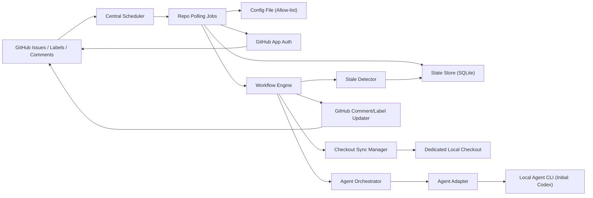

# your-issue-is-unclear 기획문서

- 작성일: 2026-03-06
- 문서 상태: 설계 확정안
- 구현 언어: Python
- AI 실행 환경: 로컬 Agent CLI (초기 구현 backend: Codex)
- 운영 방식: 사용자 로컬 PC 상시 실행
- 운영 대상: 저장소 소유자 본인의 GitHub 저장소 중 allow-list에 등록된 저장소

## 1. 프로젝트 개요

`your-issue-is-unclear`는 GitHub Issue를 읽고, 요구사항이 모호하면 질문으로 구체화한 뒤, 로컬 Agent CLI가 실제 코드베이스를 읽어 예상 작업량을 line 단위 범위로 추정하고, 그 결과를 GitHub 댓글과 라벨에 반영하는 Python 프로그램이다.

이 시스템은 "이슈 감지 -> 요구사항 명확화 -> 코드 기반 작업량 추정 -> stale 감지 -> 수동 재평가" 흐름을 자동화하는 것을 목표로 한다.

## 2. 목표

### 2.1 제품 목표

- 새 이슈를 near real-time으로 감지한다.
- 요구사항이 불충분하면 질문 루프를 통해 명확화한다.
- 요구사항이 충분해질 때까지 추정을 시작하지 않는다.
- 로컬 코드 기준으로 예상 변경 범위를 line 단위로 제시한다.
- 추정 결과와 처리 상태를 GitHub에 남긴다.
- 코드 변경 또는 요구사항 변경 이후 재평가할 수 있다.

### 2.2 성공 기준

- 새 이슈 또는 트리거 라벨 부착 후 1분 이내에 첫 반응이 시작된다.
- 명확화가 필요한 이슈는 자동 질문 댓글을 받는다.
- 필수 슬롯이 모두 채워진 이슈만 추정 단계로 진입한다.
- 추정 후 관련 파일 변경이 생기면 stale 상태로 전환될 수 있다.
- 사용자가 `/refresh`로 전체 재평가를 다시 실행할 수 있다.

## 3. 확정된 운영 원칙

- 이 시스템은 PR이 아니라 GitHub Issue만 처리한다.
- 여러 저장소를 지원하지만, 저장소 소유자 본인의 저장소만 allow-list로 등록할 수 있다.
- 저장소 등록은 단일 설정 파일에서 관리한다.
- 실행 프로세스는 중앙 scheduler가 저장소별 job을 관리하는 구조를 따른다.
- 각 저장소는 봇 전용의 별도 로컬 체크아웃을 가진다.
- 이슈는 트리거 라벨이 있을 때만 자동 처리 대상이 된다.
- clarification은 항상 PR이 열리기 전에 끝난다.
- 봇은 issue author와 repository owner의 인정 가능한 입력만 요구사항 답변으로 인정한다.
- 활성 clarification 라운드에서는 활성 clarification 댓글 편집과 `Q번호:` 형식의 새 댓글만 입력으로 인정한다.
- 권한 없는 사용자의 댓글과 명령은 조용히 무시한다.
- 봇 자신의 댓글과 라벨 변경 이벤트는 기본적으로 무시하되, 활성 clarification 댓글에 대한 승인된 사용자 편집만 예외로 처리한다.
- 댓글 언어는 한국어를 기본으로 한다.
- GitHub 인증은 private GitHub App을 사용한다.
- GitHub 댓글 작성과 라벨 변경은 private GitHub App 주체로 수행한다.
- private GitHub App은 선택한 저장소에만 설치한다.
- 저장소는 private GitHub App 설치와 allow-list 등록이 모두 완료되어야 처리 대상이 된다.

## 4. 범위

### 4.1 포함 범위

- 다중 저장소 지원
- allow-list 등록 저장소만 감시
- private GitHub App 기반 인증
- repo 단위 private GitHub App 설치
- polling 기반 이슈/댓글/라벨 이벤트 감지
- 트리거 라벨 기반 이슈 진입
- 요구사항 명확화 질문 생성
- Agent Adapter 기반 로컬 CLI 비대화형 실행
- 코드 기반 작업량 추정
- stale 감지
- `/refresh`, `/stop` 명령 처리
- GitHub 댓글 작성
- GitHub 라벨 갱신

### 4.2 제외 범위

- Pull Request 처리
- 자동 코드 작성 및 PR 생성
- 조직 단위 권한 체계
- 서버 배포를 전제로 한 webhook 기반 운영
- MVP 단계의 GitHub Projects v2 / issue field 실제 업데이트

### 4.3 단계적 확장 범위

MVP는 라벨 중심으로 운영한다. 다만 초기 아키텍처는 이후 GitHub Projects v2 또는 issue field 연동을 붙일 수 있도록 메타데이터 갱신 계층을 분리한다.

## 5. 사용자와 권한

- 저장소 소유자
  - 저장소 등록, private GitHub App 설치, bootstrap, `/stop`, 라벨 관리
- 이슈 작성자
  - 요구사항 답변, `/refresh`
- your-issue-is-unclear
  - 이벤트 감지, 상태 전이, 에이전트 실행, 댓글/라벨 반영
- Private GitHub App
  - installation token 발급, GitHub 상의 봇 정체성 제공, 댓글/라벨 변경 수행
- 로컬 Agent CLI
  - 요구사항 해석, 질문 생성, 코드 분석, line 범위 추정

권한 규칙은 아래와 같다.

- 요구사항 입력으로 인정되는 주체: 저장소 소유자, 이슈 작성자
- `/refresh` 허용 주체: 저장소 소유자, 이슈 작성자
- `/stop` 허용 주체: 저장소 소유자만
- 그 외 사용자의 댓글과 명령은 무시

## 6. 저장소 등록 및 실행 모델

### 6.1 저장소 등록

저장소는 프로젝트 저장소 내부의 단일 TOML 설정 파일에 allow-list로 등록한다.

저장소별 필수 정보:

- `owner/repo`

저장소별 선택 정보:

- `trigger_label`
- `clarification_reminder_days`
- `polling_interval_seconds`
- `base_branch_override`
- `agent_backend_override`
- `checkout_path_override`
- `enabled`

저장소가 실제 처리 대상이 되려면 아래 두 조건이 모두 만족되어야 한다.

- 해당 저장소에 private GitHub App이 설치되어 있어야 한다.
- 해당 저장소가 local allow-list 설정 파일에 등록되어 있어야 한다.

운영 메모:

- `app_installation_id`는 bootstrap 또는 초기 동기화 단계에서 조회하여 저장한다.
- 저장소 등록 시 `owner/repo`만 있으면 `bootstrap`이 전용 분석 clone을 자동 준비한다.
- 전용 분석 clone의 기본 경로는 전역 `checkout_root/<owner>/<repo>` 규칙을 따른다.
- 특정 저장소만 다른 경로를 써야 하면 `checkout_path_override`를 사용한다.
- 기본 브랜치는 GitHub API의 default branch를 사용하고, 필요 시 `base_branch_override`로 덮어쓴다.

설계 원칙:

- private GitHub App 설치 범위는 GitHub 권한 경계다.
- allow-list는 로컬 analyzer 운영 경계다.
- 새 저장소를 추가하려면 app 설치와 allow-list 등록을 모두 수행한다.

트리거 라벨은 공통 기본값을 두되, 저장소별 override를 허용한다.

권장 기본값:

- 트리거 라벨: `ai:analyze`
- 명확화 리마인드: 7일
- 저장소 polling 주기: 30초
- 활성 clarification 댓글 polling 주기: 10초
- clarification debounce: 10초
- clarification timeout: 5분
- estimate timeout: 30분
- 기본 에이전트 backend: `codex`

### 6.2 실행 구조

- 중앙 scheduler가 등록된 저장소 목록을 순회한다.
- 저장소별로 polling job을 실행한다.
- 저장소별 job은 해당 저장소의 private GitHub App installation token으로 GitHub API를 호출한다.
- 저장소별 job은 기본 polling 주기마다 최근 갱신된 issue를 읽고 상태 전이를 수행한다.
- 활성 clarification 라운드가 있는 동안에는 해당 clarification 댓글 ID를 10초 주기로 별도 polling한다.
- git clone/fetch 동기화도 private GitHub App installation token 기반 HTTPS로 수행한다.
- 에이전트 분석은 저장소별 전용 full clone을 기준으로 수행한다.
- 저장소별 코드 분석 작업은 직렬로 처리하고, clarification 관련 경량 판정은 병행 가능하게 둔다.

### 6.3 설정 및 런타임 경로

- GitHub App 시크릿은 설정 파일이 아니라 환경 변수로 관리한다.
- allow-list 설정 파일은 프로젝트 저장소 내부의 TOML 파일로 유지한다.
- 가변 런타임 데이터는 OS 표준 앱 경로에 저장한다.
  - 단일 전역 SQLite DB
  - 저장소별 전용 분석 clone
  - 로그 파일
- 런타임 경로 계산은 `platformdirs` 같은 OS 표준 경로 규약을 사용한다.
- 경로 override는 환경 변수로만 허용한다.

### 6.4 GitHub App 권한 원칙

- MVP의 GitHub App 권한은 최소 권한 원칙을 따른다.
- GitHub App 권한은 아래 3개로 고정한다.
  - `Issues: Read & write`
  - `Contents: Read`
  - `Metadata: Read`
- 댓글/라벨 처리에 필요한 이슈 읽기/쓰기 범위만 허용한다.
- 기본 브랜치 조회와 clone/fetch에 필요한 저장소 읽기 범위만 허용한다.
- 현재 MVP 범위를 넘는 PR, Projects, issue field 관련 권한은 추가하지 않는다.

## 7. 핵심 워크플로

### 7.1 이슈 진입 조건

이슈는 아래 중 하나를 만족할 때 분석 대상이 된다.

- 이슈 생성 시점에 트리거 라벨이 이미 붙어 있음
- 생성 후 트리거 라벨이 새로 부착됨

트리거 라벨이 나중에 부착된 경우, 시스템은 그 시점 이후만 읽는 것이 아니라 현재 이슈 스냅샷 전체를 사용한다.

현재 이슈 스냅샷의 범위:

- 최신 이슈 본문
- 그 시점까지 존재하는 인정 가능한 댓글 전체

트리거 라벨은 "시작 신호"이다. 시작 후 단순 라벨 제거만으로 기존 워크플로를 중단하지 않는다.

### 7.2 요구사항 명확화

이슈는 다음 필수 슬롯이 모두 충족될 때까지 추정 단계로 가지 않는다.

- 목적
- 기대 동작
- 입력/출력
- 변경 대상
- 완료 조건

`입력/출력`은 해당 없는 경우 `N/A`를 허용한다.

보조 슬롯:

- 예외 케이스

보조 슬롯은 상황에 따라 질문할 수 있지만, 모든 이슈에서 필수는 아니다.

명확화 규칙:

- clarification은 체크리스트 기반 댓글 UX를 사용한다.
- 한 라운드의 질문 수는 최대 3개다.
- 봇은 활성 clarification 댓글 1개를 만들고, 사용자는 그 댓글을 직접 편집해서 답변한다.
- 질문별로 `single-select` 또는 `multi-select` 타입을 명시한다.
- 질문별로 허용 선택 수를 `min/max` 형태로 명시한다.
- 옵션 설명과 추천 옵션은 체크박스 줄 아래에 따로 적는다.
- 선택지에 없으면 체크하지 말고 새 issue 댓글로 `Q번호: 직접 입력 내용` 형식으로 답한다.
- 활성 clarification 라운드에서는 활성 clarification 댓글 편집과 `Q번호:` 형식의 새 댓글만 답변 입력으로 인정한다.
- 활성 clarification 라운드 동안 issue 본문 수정은 clarification slot 충족 판단에 사용하지 않는다.
- 이미 답변된 내용은 반복 질문하지 않는다.
- 필요한 슬롯이 모두 채워질 때까지 질문 루프를 계속한다.
- 답이 없으면 `needs-clarification` 상태를 유지한다.
- 설정된 일수 경과 후 1회만 리마인드 댓글을 남긴다.
- 사용자가 체크를 수정하는 중간 상태를 바로 오류로 보지 않도록, 댓글 편집은 기본 10초 debounce 이후 검증한다.
- 새 clarification 라운드가 시작되면 이전 라운드는 `superseded`로 간주하고 이후 수정은 무시한다.

질문별 유효성 규칙:

- `single-select`: 체크 수가 `min/max` 범위 안에 있거나, 새 댓글의 `Q번호:` 자유 입력이 1개 있으면 유효
- `multi-select`: 체크 수가 `min/max` 범위 안에 있거나, 새 댓글의 `Q번호:` 자유 입력이 1개 있으면 유효
- 체크 응답과 자유 입력이 동시에 있으면 오류
- 체크 수가 허용 범위를 벗어나면 오류
- 모든 질문이 유효해져야 해당 clarification 라운드를 완료로 본다

### 7.3 작업량 추정 시작 조건

아래 조건이 모두 만족될 때만 추정을 시작한다.

- 이슈가 트리거 라벨 대상이다.
- 필수 슬롯이 모두 채워졌다.
- 이슈가 `STOPPED` 상태가 아니다.
- 이슈가 `open` 상태다.

### 7.4 코드 동기화 기준

추정 또는 재평가 직전에는 저장소 전용 체크아웃을 원격 기본 브랜치의 최신 HEAD로 동기화한다.

기본 브랜치 결정 규칙:

- 기본은 GitHub API의 default branch를 따른다.
- 저장소별 `base_branch_override`가 있으면 그것을 우선한다.

이 기준은 아래 항목의 기준점이 된다.

- base commit SHA
- stale 판정 기준
- 댓글에 남기는 분석 시점 정보

### 7.5 에이전트 분석

Python 애플리케이션은 Agent Adapter를 통해 현재 활성 backend를 로컬 CLI subprocess로 호출한다.

아키텍처 원칙:

- 코어 애플리케이션은 backend 중립적인 분석 요청 객체를 만든다.
- 애플리케이션이 표준 JSON 응답 스키마를 소유한다.
- Agent Adapter가 backend별 프롬프트를 렌더링하고 CLI 호출을 수행한다.
- 전역 기본 backend를 두고, 저장소별 `agent_backend_override`를 허용한다.
- MVP 실행 방식은 로컬 CLI subprocess만 지원한다.
- 초기 구현 backend는 `codex`지만, 이후 `claude` 등 다른 CLI backend로 교체 가능해야 한다.

호출 원칙:

- 입력: 이슈 본문, 인정 가능한 댓글, 저장소 경로, 응답 스키마
- 출력: JSON 형식의 구조화 결과
- 허용 작업: 저장소 내부 파일 검색, 파일 읽기, `git diff/log` 등 읽기 전용 탐색
- 금지 작업: 코드 수정, 빌드 실행, 테스트 실행
- clarification timeout 기본값: 5분
- estimate timeout 기본값: 30분
- timeout은 전역 설정으로 조정 가능하다.
- 일시적인 CLI 실패 또는 JSON 파싱 실패는 1회 자동 재시도한다.
- 재시도 후에도 실패하면 오류 상태로 전환한다.

추정 범위에 포함되는 변경:

- 애플리케이션 코드
- 테스트 코드
- 설정 파일
- 마이그레이션

추정 범위에서 분리해서 다루는 항목:

- 문서 변경

문서 변경은 필요 시 별도 언급은 가능하지만 핵심 작업량 수치에는 포함하지 않는다.

### 7.6 추정 결과 형식

추정 댓글은 최소 아래 정보를 포함해야 한다.

- 기준 커밋 SHA
- 예상 추가 line 범위
- 예상 수정 line 범위
- 예상 삭제 line 범위
- 총 영향 범위
- 주요 대상 파일 후보
- 신뢰도
- 근거

예시 형식:

- 예상 추가: `+40 ~ +90 lines`
- 예상 수정: `80 ~ 150 lines touched`
- 예상 삭제: `0 ~ 20 lines`
- 총 영향 범위: `120 ~ 260 lines`
- 신뢰도: `low | medium | high`

### 7.7 stale 판정

자동 stale 판정은 아래 규칙을 따른다.

1. 추정 결과에 영향 파일 후보 목록이 있어야 한다.
2. base commit 이후 기본 브랜치에서 변경된 파일 목록을 구한다.
3. 두 목록이 겹치면 `STALE` 상태로 전환한다.

보수 규칙:

- 영향 파일 후보가 비어 있으면 자동 stale 판정을 하지 않는다.
- 단순히 기본 브랜치 HEAD가 바뀌었다는 이유만으로 stale 처리하지 않는다.
- 자동 stale 전환 시 별도 댓글은 남기지 않고 `ai:stale` 라벨만 갱신한다.

### 7.8 `/refresh`

`/refresh`는 전체 재평가 명령이다.

동작 원칙:

- 현재 상태와 무관하게 이슈 전체를 다시 읽는다.
- 본문과 댓글을 다시 판정한다.
- 필요하면 다시 질문한다.
- 추정 가능 상태면 새 기준 커밋으로 다시 계산한다.

예외:

- `STOPPED` 상태에서는 `/refresh`를 무시한다.

### 7.9 요구사항 변경 후 처리

이미 `ESTIMATED` 상태인 이슈라도, 인정 가능한 본문 수정 또는 댓글로 요구사항이 달라지면 기존 추정을 최신으로 보지 않는다.

이 경우:

- 상태를 `NEEDS_CLARIFICATION`로 되돌린다.
- 신뢰도 라벨을 제거한다.
- 자동 재추정은 하지 않는다.
- 이후 다시 필수 슬롯이 충족되어야 추정 단계로 복귀한다.

### 7.10 `/stop`, close, reopen

`/stop`은 저장소 소유자만 사용할 수 있다.

`/stop` 규칙:

- 상태를 `STOPPED`로 전환한다.
- 이후 `/refresh`는 무시한다.
- 이슈가 reopen 되더라도 자동 재개하지 않는다.

`STOPPED` 이슈 재개 규칙:

- 저장소 소유자가 트리거 라벨을 제거한 뒤 다시 부착해야 한다.

`closed` / `reopened` 규칙:

- 이슈가 `closed` 되면 자동 처리를 중단한다.
- `reopened` 되고 트리거 라벨이 있으면 전체 재평가를 수행한다.
- 단, 이전에 `/stop` 된 이슈는 라벨 재부착 전까지 재개하지 않는다.

## 8. 라벨 및 메타데이터 규칙

### 8.1 bootstrap

초기 `bootstrap` 명령은 각 저장소에 필요한 라벨을 생성한다.

### 8.2 트리거 라벨

- 기본값: `ai:analyze`
- 저장소별 override 가능
- 워크플로 시작 신호로 사용

### 8.3 상태 라벨

상태 라벨은 사용자에게 의미 있는 전체 워크플로 상태를 노출한다.

권장 상태 라벨:

- `ai:needs-clarification`
- `ai:ready-for-estimate`
- `ai:estimating`
- `ai:estimated`
- `ai:stale`
- `ai:refreshing`
- `ai:stopped`
- `ai:error`

운영 규칙:

- 상태 라벨은 항상 1개만 활성화한다.
- 상태가 바뀌면 기존 상태 라벨을 제거하고 새 상태 라벨을 붙인다.

### 8.4 신뢰도 라벨

권장 신뢰도 라벨:

- `ai:confidence:low`
- `ai:confidence:medium`
- `ai:confidence:high`

운영 규칙:

- 최신 추정이 존재할 때만 신뢰도 라벨을 붙인다.
- 신뢰도 라벨도 항상 1개만 활성화한다.
- 최신 추정이 무효화되면 신뢰도 라벨을 제거한다.

### 8.5 메타데이터 확장 방향

MVP는 라벨 중심으로 운영한다. 다만 메타데이터 갱신 계층은 향후 아래 확장을 수용할 수 있어야 한다.

- GitHub Projects v2 field 업데이트
- issue field 업데이트
- 추정 수치의 구조화 저장

## 9. 댓글 템플릿 원칙

### 9.1 명확화 질문 댓글

포함 요소:

- 현재 부족한 슬롯 요약
- 최대 3개의 질문
- 질문 번호
- 질문 타입 (`single-select` 또는 `multi-select`)
- 허용 선택 수 (`min/max`)
- 체크리스트 선택지
- 옵션 설명과 추천 옵션
- 선택지 밖 답변 시 `Q번호: 내용` 형식의 새 댓글 안내
- 답변 완료 후 다음 단계 안내

응답 원칙:

- 사용자는 활성 clarification 댓글을 직접 편집해 체크한다.
- 자유 입력이 필요하면 새 issue 댓글로 답한다.
- analyzer는 활성 clarification 댓글 편집만 예외적으로 유효 입력으로 인정한다.
- 이전 clarification 라운드 댓글 수정은 무시한다.

### 9.2 추정 결과 댓글

포함 요소:

- 분석 시각
- 기준 브랜치
- 기준 커밋
- line 범위
- 주요 파일 후보
- 신뢰도
- 근거
- `/refresh` 안내

### 9.3 stale 전환

자동 stale 전환은 댓글 없이 `ai:stale` 라벨만 갱신한다.

### 9.4 리마인드 댓글

포함 요소:

- 아직 부족한 슬롯
- 마지막 질문 이후 경과 일수
- 답변 필요 안내

모든 댓글은 한국어로 작성한다.

## 10. 상태 모델

워크플로 상태는 아래와 같이 정의한다.

- `NEW`
- `NEEDS_CLARIFICATION`
- `READY_FOR_ESTIMATE`
- `ESTIMATING`
- `ESTIMATED`
- `STALE`
- `REFRESHING`
- `STOPPED`
- `ERROR`

대표 전이:

`NEW -> NEEDS_CLARIFICATION -> READY_FOR_ESTIMATE -> ESTIMATING -> ESTIMATED -> STALE -> REFRESHING -> ESTIMATED`

추가 전이:

- `ESTIMATED -> NEEDS_CLARIFICATION`
  - 요구사항 변경 감지 시
- `ANY -> STOPPED`
  - 저장소 소유자 `/stop`
- `STOPPED -> NEW`
  - 트리거 라벨 제거 후 재부착 시 새 진입으로 간주

이슈 라이프사이클 이벤트 규칙:

- 이슈가 `closed` 되면 자동 처리를 중단한다.
- 이슈가 `reopened` 되고 트리거 라벨이 있으면 전체 재평가를 수행한다.
- 단, `STOPPED` 이슈는 라벨 재부착 전까지 재개하지 않는다.

## 11. 시스템 아키텍처 초안



### 11.1 컴포넌트

- Central Scheduler
  - 등록된 저장소를 순회하고 repo job 실행 주기를 관리
- Repo Polling Jobs
  - 저장소별 최근 갱신 issue 수집, 활성 clarification 댓글 편집 감지
- Config File
  - allow-list 저장소와 저장소별 설정 제공
- GitHub App Auth
  - 저장소별 installation token 발급 및 갱신
- Workflow Engine
  - 상태 전이, 권한 판정, 명령 처리
- Checkout Sync Manager
  - 전용 체크아웃을 기본 브랜치 HEAD로 동기화
- Agent Orchestrator
  - 분석 요청 생성, timeout/retry 제어, 응답 검증
- Agent Adapter
  - backend별 프롬프트 렌더링, CLI subprocess 실행, 표준 JSON 스키마 매핑
- Stale Detector
  - 영향 파일과 실제 변경 파일 비교
- GitHub Comment/Label Updater
  - private GitHub App 주체로 댓글과 라벨 반영

## 12. Python 구현 방향

### 12.1 권장 기술 스택

- 패키지/실행 관리: `uv`
- 워커 런타임: `asyncio` 기반 polling worker
- GitHub 클라이언트: `httpx` 기반 자체 얇은 REST/GraphQL 클라이언트
- 인증: GitHub App JWT + 저장소별 installation token
- 설정 로딩: `tomllib` + 환경 변수
- 데이터 저장소: SQLite
- 경로 관리: `platformdirs`
- 모델 계층: SQLAlchemy + Pydantic
- CLI: Typer
- 에이전트 실행: Adapter pattern + 로컬 CLI subprocess
- 로깅: structlog 또는 표준 logging

### 12.2 실행 모드

- `worker`
  - 등록 저장소 polling 및 자동 처리
- `bootstrap`
  - 대상 저장소의 private GitHub App 설치 여부, 라벨 생성, 초기 설정 검증, 전용 분석 clone 준비
- `refresh <owner/repo> <issue-number>`
  - 로컬 관리용 강제 재평가 CLI

## 13. 에이전트 연동 설계

에이전트 backend는 로컬 CLI subprocess로 호출한다.

연동 원칙:

- 코어는 backend 중립적인 `AgentRequest`를 구성한다.
- Agent Adapter가 backend별 프롬프트를 렌더링한다.
- 응답은 앱이 소유한 표준 JSON 스키마로 통일한다.
- MVP는 CLI backend만 지원한다.
- 초기 backend는 `codex`이며, 향후 `claude` 같은 다른 CLI로 교체 가능해야 한다.

입력 컨텍스트:

- 저장소 식별자
- 로컬 체크아웃 경로
- 최신 이슈 본문
- 인정 가능한 댓글 목록
- 응답 JSON 스키마

예상 응답 예시:

```json
{
  "status": "estimated",
  "ready_for_estimate": true,
  "questions": [],
  "estimate": {
    "base_commit": "abc1234",
    "lines_added_min": 40,
    "lines_added_max": 90,
    "lines_modified_min": 80,
    "lines_modified_max": 150,
    "lines_deleted_min": 0,
    "lines_deleted_max": 20,
    "lines_total_min": 120,
    "lines_total_max": 260,
    "confidence": "medium",
    "files": [
      "app/workflow/engine.py",
      "app/github/client.py"
    ],
    "reasons": [
      "이슈 이벤트 감지와 상태 전이 로직이 함께 수정됨",
      "라벨 갱신과 stale 판단을 위한 별도 계층이 필요함"
    ]
  }
}
```

명확화 응답 예시:

```json
{
  "status": "needs_clarification",
  "ready_for_estimate": false,
  "missing_slots": [
    "input_output",
    "done_criteria"
  ],
  "question_specs": [
    {
      "question_id": "Q1",
      "slot": "input_output",
      "type": "single-select",
      "min_select": 1,
      "max_select": 1,
      "prompt": "입력/출력 변경 여부를 선택해 주세요.",
      "options": [
        "있음",
        "없음 (N/A)",
        "아직 미정"
      ],
      "recommended_option": "없음 (N/A)"
    },
    {
      "question_id": "Q2",
      "slot": "done_criteria",
      "type": "single-select",
      "min_select": 1,
      "max_select": 1,
      "prompt": "완료 조건을 선택해 주세요.",
      "options": [
        "동작 구현만",
        "테스트 포함",
        "테스트 + 문서 포함"
      ],
      "recommended_option": "테스트 포함"
    }
  ]
}
```

## 14. 데이터 모델 초안

### 14.1 AppSettings

- `config_file_path`
- `state_db_path`
- `checkout_root`
- `log_root`
- `clarification_debounce_seconds`
- `active_clarification_polling_seconds`
- `clarification_timeout_seconds`
- `estimate_timeout_seconds`
- `default_agent_backend`

### 14.2 RepoRegistration

- `owner_repo`
- `app_installation_id`
- `checkout_path`
- `checkout_path_override`
- `trigger_label`
- `clarification_reminder_days`
- `polling_interval_seconds`
- `base_branch_override`
- `agent_backend_override`
- `enabled`

### 14.3 IssueRecord

- `owner_repo`
- `issue_number`
- `issue_id`
- `issue_state`
- `workflow_state`
- `trigger_label_present`
- `latest_processed_comment_id`
- `latest_body_hash`
- `active_clarification_round`
- `active_clarification_comment_id`
- `base_branch`
- `base_commit_sha`
- `last_estimated_at`

### 14.4 ClarificationSession

- `owner_repo`
- `issue_number`
- `round`
- `clarification_comment_id`
- `missing_slots`
- `question_specs`
- `answer_sources`
- `reminder_sent`
- `resolved`
- `superseded`
- `superseded_at`

### 14.5 EstimateSnapshot

- `owner_repo`
- `issue_number`
- `base_commit_sha`
- `lines_added_min`
- `lines_added_max`
- `lines_modified_min`
- `lines_modified_max`
- `lines_deleted_min`
- `lines_deleted_max`
- `lines_total_min`
- `lines_total_max`
- `confidence`
- `candidate_files`
- `reasons`
- `created_at`

### 14.6 JobRun

- `job_type`
- `owner_repo`
- `started_at`
- `finished_at`
- `status`
- `error_message`

## 15. 비기능 요구사항

- 신뢰성
  - 동일 이벤트를 중복 처리하지 않는다.
- 추적성
  - 모든 상태 변경, 에이전트 호출, 댓글/라벨 변경을 로그로 남긴다.
- 일관성
  - 추정과 stale 판정은 항상 기본 브랜치 HEAD 기준으로 수행한다.
- 안전성
  - 권한 없는 사용자의 입력은 무시한다.
- 루프 방지
  - 봇 자신의 댓글과 라벨 이벤트를 다시 처리하지 않는다.
  - 단, 활성 clarification 댓글에 대한 승인된 사용자 편집은 예외적으로 처리한다.
- 운영성
  - 저장소별 설정과 상태를 쉽게 확인할 수 있어야 한다.
  - private GitHub App 설치 상태와 allow-list 상태를 구분해서 확인할 수 있어야 한다.
- 교체 가능성
  - 표준 JSON 스키마와 Agent Adapter로 backend 종속성을 격리한다.

## 16. MVP 정의

### 16.1 MVP 포함 항목

- 다중 저장소 allow-list
- private GitHub App 기반 인증
- repo 단위 private GitHub App 설치
- 로컬 PC 상시 worker
- polling 기반 이벤트 감지
- 트리거 라벨 기반 진입
- 체크리스트 기반 clarification 댓글 UX
- 활성 clarification 댓글 편집 감지
- 질문별 타입 및 min/max 선택 수 검증
- 엄격한 명확화 질문 루프
- `Q번호:` 형식 자유 입력 fallback
- Agent Adapter 기반 로컬 CLI 연동
- 초기 `codex` backend 구현
- line 범위 추정 댓글
- 상태 라벨 / 신뢰도 라벨 갱신
- stale 감지
- `/refresh`
- `/stop`
- bootstrap 라벨 생성

### 16.2 MVP 제외 항목

- PR 지원
- GitHub Projects v2 실제 필드 업데이트
- issue custom field 실제 업데이트
- webhook 기반 이벤트 수신
- 자동 코드 작성

## 17. 리스크와 대응

### 17.1 polling 기반 반응 속도 한계

대응:

- 저장소 기본 polling 주기는 30초로 두고 저장소별 override를 허용
- 활성 clarification 댓글은 별도 10초 polling으로 보강
- repo job 병렬도는 저장소 수에 맞춰 조정

### 17.2 line 추정의 불확실성

대응:

- 단일 숫자가 아닌 범위 제공
- 신뢰도와 근거를 함께 표기
- stale 및 `/refresh` 제공

### 17.3 에이전트 출력 불안정

대응:

- JSON schema 강제
- 일시적인 CLI/JSON 오류는 1회 자동 재시도
- 재시도 후에도 실패하면 오류 상태로 전환

### 17.4 다중 저장소 운영 복잡도

대응:

- allow-list 설정 파일로 명시적 관리
- 저장소별 전용 체크아웃과 저장소별 설정 분리

### 17.5 잘못된 자동 반응

대응:

- 트리거 라벨 게이트 사용
- 권한 있는 사용자만 입력 인정
- `/stop` 지원

### 17.6 특정 에이전트 backend 종속

대응:

- Agent Adapter 계층으로 backend 실행을 분리
- 표준 JSON 스키마는 애플리케이션이 소유
- 전역 기본 backend와 저장소별 override를 지원

## 18. 권장 다음 단계

1. 이 확정안을 기준으로 아키텍처 상세 설계 문서를 작성한다.
2. TOML allow-list 스키마, 전역 설정, SQLite 스키마를 구체화한다.
3. GitHub polling(updated issue + 활성 clarification 댓글) / bootstrap auto clone / Agent Adapter CLI 인터페이스를 먼저 구현한다.
4. 이후 명확화 엔진, stale detector, 댓글/라벨 updater를 순차적으로 붙인다.
